# Developing Vending Machine UIs using VMUI
Vorachet Jaroensawas

# VMUI

VMUI (Vending Machine User Interface) is a simple vending machine simulator that allows a user to purchase items from a vending machine. The vending machine has a set of items with prices, and the user can select an item and enter their payment to receive the item. There are several benefits to using a vending machine simulator: Practice React coding: Creating a vending machine simulator can be a good way to practice coding and problem-solving skills, Understand how vending machines work, and Test ideas in designing React components.


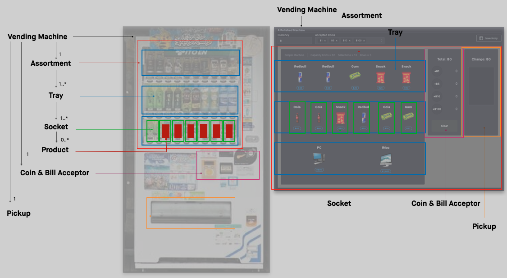

Fig 1. shows the structure of vending machine and part definition that will be implemented in VMUI


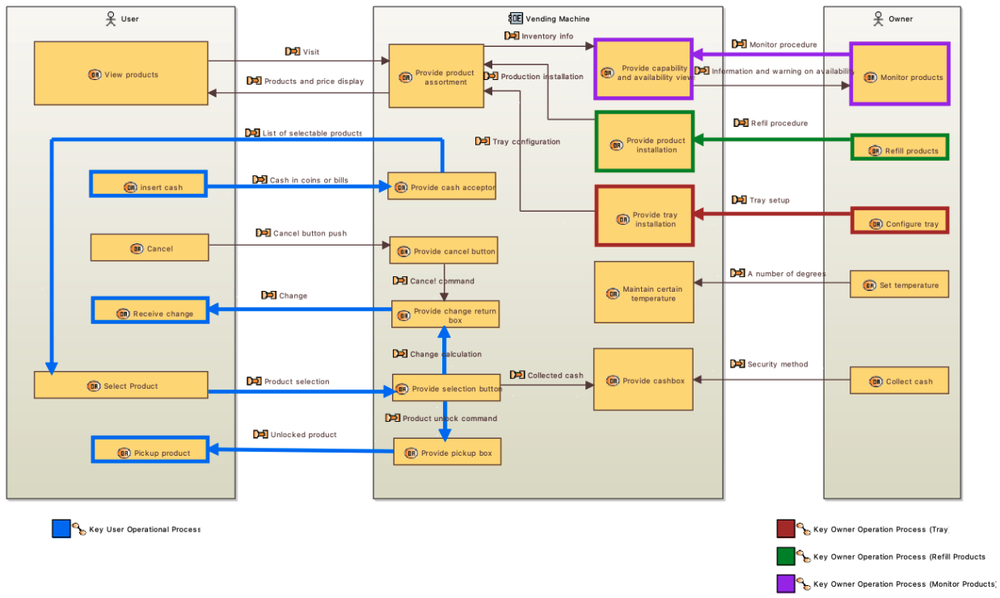

Fig 2. Operations of Interest


## The operations of vending machines and their associations with actors 

  - System::provideProductAssortment
    - User::viewProducts
  - System::provideCashAcceptor
    - User::insertCash
  - System::provideSelectionButton
    - User::selectProduct
  - System::provideChangeReturnBox
    - User::recieveChange
  - System::providePickupBox
    - User::pickupProduct
  - System::System::provideCancelButton
    - User::cancel
  - System::provideCapabilityAndAvailabilityViews
    - Owner::monitorProducts
  - System::provideProductionInstallation
    - Owner::refilProducts
  - System::provideTrayInstallation
    - Owner::configureTray


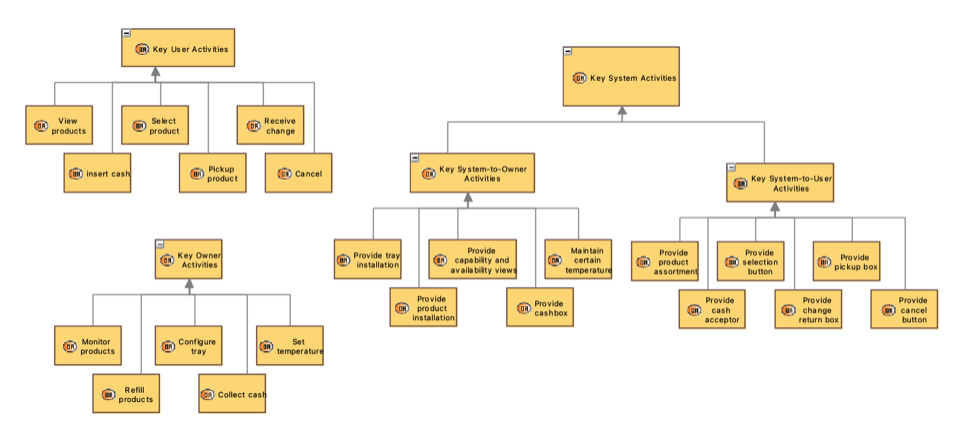

Fig 3. Structure of operations

* Note that we did not do anything with the following operations at this time; System::maintainCertainTemperature (Onwer::setTemperature) and System::provideCashbox (Owner::collectCash)

## Allocating the system operations to the high-level software components

To partially realize the abstraction in Fig. 1, the following software components were introduced to interact with the required system operations.

  - `Software::Assortment` 
    - User::viewProducts <-> System::provideProductAssortment
    - User::selectProduct <-> System::provideSelectionButton'
    - User::cancel <-> System::provideCancelButton'
  - `Software::CashAcceptor` 
    - User::insertCash <-> System::provideCashAcceptor
  - `Software::Pickup` 
    - User::recieveChange <-> System::provideChangeReturnBox
    - User::pickupProduct <-> System::providePickupBox
  - `Software::Inventory` 
    - Owner::monitorProducts <-> System::provideCapabilityAndAvailabilityViews
  - `Software::AdminControls`
    - Owner::refilProducts <-> System::provideProductInstallation
    - Owner::configureTray <-> System::provideTrayInstallation

# The intended design and the validation

The ultimate goal of this mini-project is to make it easier to develop configurable vending machine simulators, so there will be high-level components that ease the development tasks.

## High-level React components
```
  import { VMUI } from "..."
  import { VMSdk } from "..."
  const LAYOUT = /*A very simple 2D array for representating assortment */
  const PRODUCTS = {...}
  function VendingMachine() {
    return (
      <VMUI.Assortment layout={LAYOUT} products={PRODUCTS} />  
      <VMUI.CashAcceptor />    
      <VMUI.Pickup />      
      <VMUI.AdminControls />   
    )
  }
```

To provide objective evidence that the VMUI users evaluate this mini-project quickly, this codebase comes with the following apps.
  - A simple vending machine
  - A simple machine with controls
  - A polished machine 
  - VMUI components demo

# The representation of physical assortment, trays, and sockets

The vending machine that automatically shows buyable products that match the amount of coins added to the machine seems to be the target for our first MVP. Most modern machines offer this service flow, which we often see in real life. Note that most commercial machines use a spiral spring to control a dispenser that does not require the user to enter the product but instead instantly touches the screen of the button of a buyable product. An assortment (see Fig. 1) is a collection of slots used to store products. Machines that sell a wide range of products often have different assortment models. At this point, this project should have a number of assortment models for configuration options. Assortments can have different slots and widths in each row to allow for the real-world vending machine.

## Designing Tray Models

The examples of physical assortment and the represenation of assortment in Javascript 2D array

```
#1 A symmetric assortment with capacity 20 units, 1 trays, 2 selections
|   10    |    10   | 
const trayModel = [[10,10]];

----------------------------

#2 A symmetric assortment with capacity 40 units, 4 trays, 4 selections
|   10    |    10   | 
|   10    |    10   | 
const trayModel = [ 
  [10,10]
  [10,10]
];

----------------------------

#3 A symmetric assortment with capacity 206 units, 4 trays, 16 selections
|   10    |    10   |   10    |   10  | 
|   10    |    12   |   12    |   12  | 
|   15    |    15   |   15    |   15  |   
|   15    |    15   |   15    |   15  |   
const trayModel = [ 
  [10,10,10,10],
  [10,12,12,12],
  [15,15,15,15],
  [15,15,15,15]
];

----------------------------

#4 An asymmetric assortment with capacity 368 units, 4 trays, 22 selections
|   10    |    10   |   10    |   10  |
|   10    |    10   |   10    |   10  |
| 12  |  12 |  24 | 24 | 24 | 24 | 24 |
| 12  |  12 |  24 | 24 | 24 | 24 | 24 | 
const trayModel = [ 
  [10,10,10,10],
  [10,10,10,10],
  [12,12,24,24,24,24,24],
  [12,12,24,24,24,24,24],
];
```
## We have built a Tray Render Engine

To have flexibility in the development of different vending machine assortments, we need a render engine that understands the Javascript 2D array introduced in the previous section.


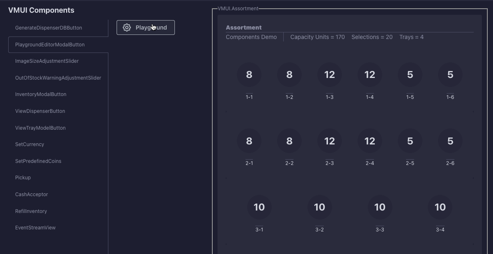

# System Deign

## Logical Architecture

How the vending machine will work to fulfil the reqiured system operations


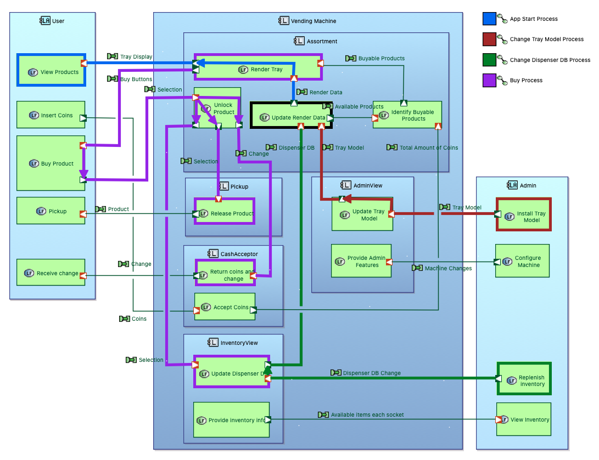

# Demo Apps

Note that the collection of demo apps with this mini-project uses a shared Redux store.

## ComponentsDemo for Learning VMUI Components


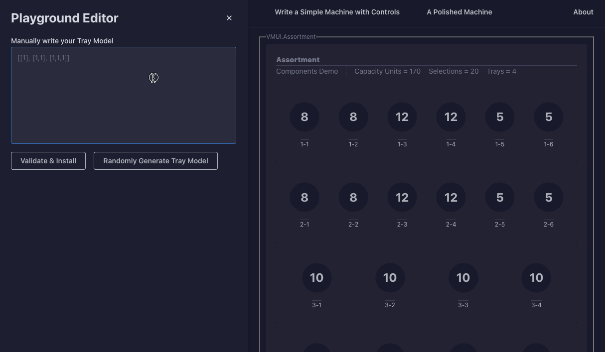

# Writing a simple vending machine

We finalize the design of high-leve React component using the following example code
```
├── apps
│   ├── SimpleMachine.js
```


```
  import { VMUI } from "../vmdk/ui/VMUI"
  import { VMSdk } from "../vmdk/VMSdk"
  const TRAY_MODEL = VMSdk.buildTrayModel(
    "Simple Machine",
    [[10, 10], [10, 10]]);
  const DISPENSER_DB = {...}
  function SimpleMachine() {
    return (
      <VMUI.Assortment 
        trayModel={TRAY_MODEL}
        dispenserDB={DISPENSER_DB} />
      <VMUI.CashAcceptor />
      <VMUI.Pickup />
    )
  }

  export default SimpleMachine;

```

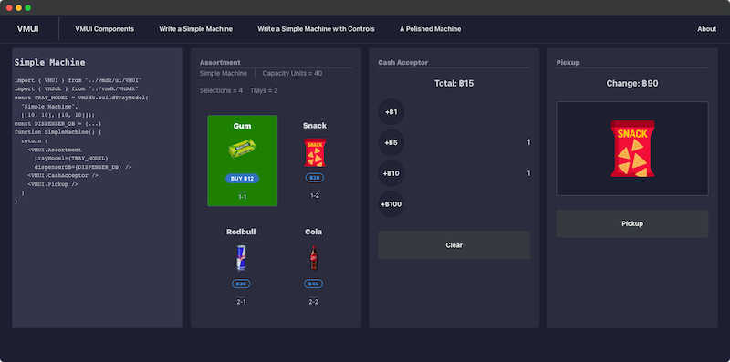


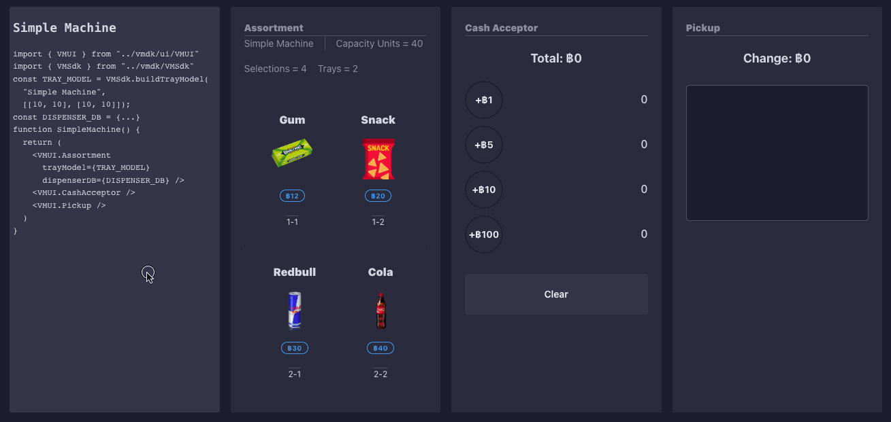

## Writing a simple vending machine with controls
```
├── apps
│   └── SimpleMachineWithControls.js
```

```
  import { VMUI } from "../vmdk/ui/VMUI"
  import { VMSdk } from "../vmdk/VMSdk"
  const TRAY_MODEL = 
    VMSdk.buildTrayModel(
      "Simple Machine with Controls",
      [[10, 10], [10, 10]]);
  const DISPENSER_DB = {...}
  function SimpleMachine() {
    return (
      {/* Main Machine Components */}
      <VMUI.Assortment 
        trayModel={TRAY_MODEL}
        dispenserDB={DISPENSER_DB} />
      <VMUI.CashAcceptor />
      <VMUI.Pickup />

      {/* Controls */}
      <VMUI.InventoryModalButton />
      <VMUI.PlaygroundEditorModalButton />
      <VMUI.GenerateDispenserDBButton />
      <VMUI.ViewDispenserButton />
      <VMUI.ViewTrayModelButton />
      <VMUI.ImageSizeAdjustmentSlider />
      <VMUI.OutOfStockWarningAdjustmentSlider />
      <VMUI.SetCurrency />
      <VMUI.SetPredefinedCoins />
    )
  }

  export default SimpleMachineWithControls;
```


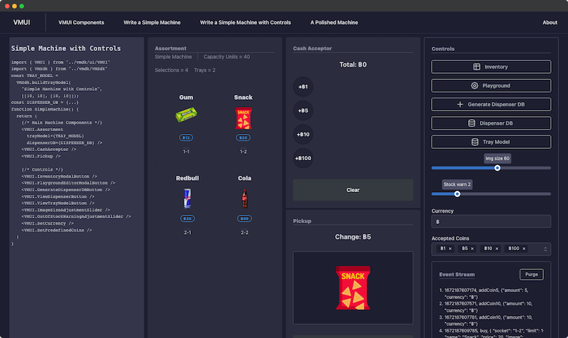


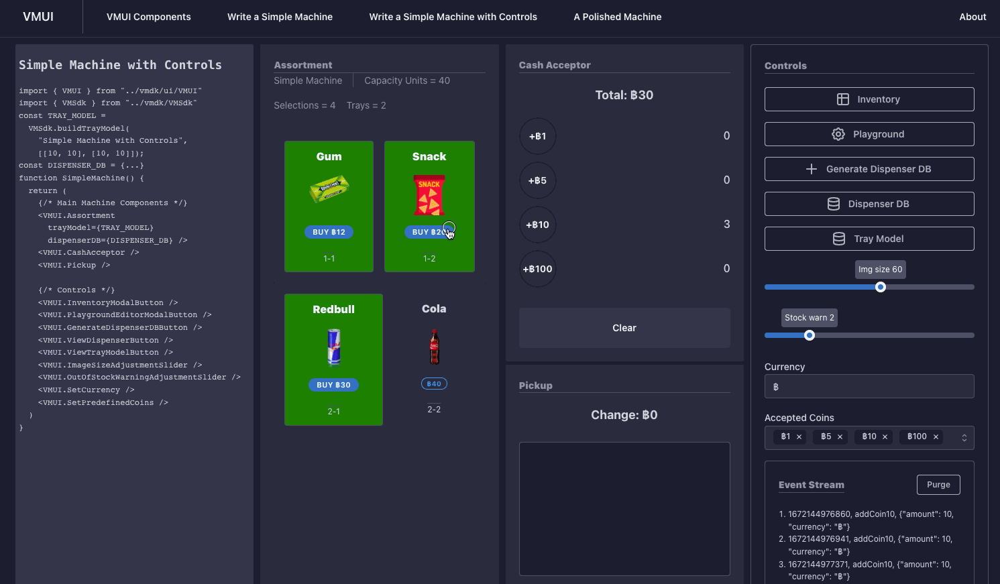

## Writing a polished vending machine

```
├── apps
│   ├── Polished.js
```

```
  import { VMUI } from "../vmdk/ui/VMUI"
  import { VMSdk } from "../vmdk/VMSdk"
  const TRAY_MODEL = VMSdk.buildTrayModel("Polished Machine", [
    [10, 10, 10, 10, 10],
    [5, 5, 5, 5, 5, 5],
    [1, 1]
  ]);
  const DISPENSER_DB = {...}
  function Polished() {
  return (
    <Container style={{minWidth: 1200}}>
      <StdTitle title="A Polished Machine" />
      <Group position="apart">
        <Group>
          <VMUI.SetCurrency />
          <VMUI.SetPredefinedCoins />
        </Group>
        <Group>
          <VMUI.InventoryModalButton />
        </Group>
      </Group>
      <Card withBorder shadow="xl" 
        style={{ background: "gray" }} my={10}>
        <Grid>
          <Grid.Col span={8}>
            <VMUI.Assortment
              showTitle={false}
              showSocket={false}
              trayModel={TRAY_MODEL}
              dispenserDB={DISPENSER_DB} />
          </Grid.Col>
          <Grid.Col span={4}>
            <SimpleGrid cols={2}>
              <VMUI.CashAcceptor showTitle={false} />
              <VMUI.Pickup showTitle={false}/>
            </SimpleGrid>
          </Grid.Col>
        </Grid>
      </Card>      
    </Container>
  );
}

export default Polished;

```

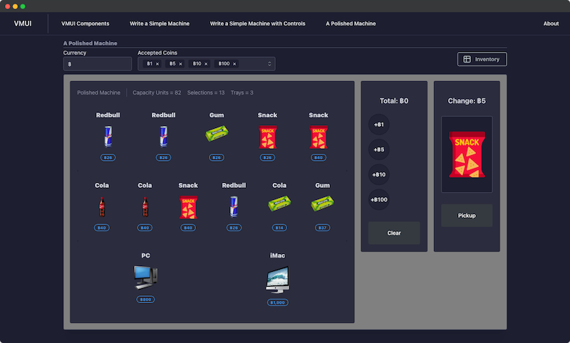


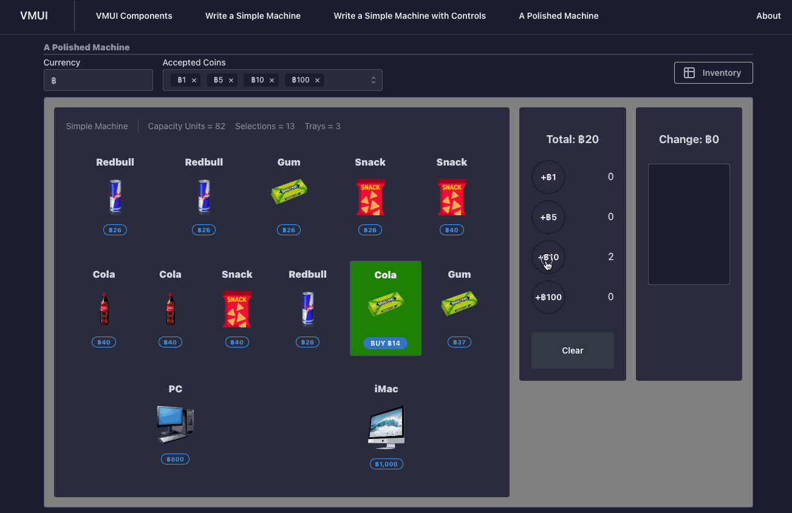

# The codebase

```
├── apps                  ExampleApps
├── tests                 Unit Tests
└── vmdk                   
    ├── VMSdk.js          VMSU SDK 
    ├── state             VMUI Redux Stores
    └── ui                VMUI Components
         ├── VMSdk.js 
```

## Downloading packages and dependencies.

```
npm install
```

## Running the VMUI Demo Apps
```
npm start

Open http://localhost:3000/
```

## Running Unit tests

The project currently has one unit test. It was used to test the implementation of the 2D array tray model.
```
npm run test

 PASS  src/tests/VMSdk.test.js
  ✓ buildTrayModel null (3 ms)
  ✓ buildTrayModel undefined (1 ms)
  ✓ buildTrayModel {}
  ✓ buildTrayModel {name: 1} (1 ms)
  ✓ buildTrayModel ""
  ✓ buildTrayModel true (1 ms)
  ✓ buildTrayModel 1
  ✓ buildTrayModel []
  ✓ buildTrayModel [1, [], {}]
  ✓ buildTrayModel [1, 1, 1]
  ✓ buildTrayModel [[]]
  ✓ buildTrayModel [[], []]
  ✓ buildTrayModel [[1], []]
  ✓ buildTrayModel [[1], [1], [1]] (57 ms)
  ✓ buildTrayModel [[1,1], [1,1], [1,1]] (7 ms)
  ✓ buildTrayModel [[1], [2,2], [3,3,3]] (1 ms)
  ✓ buildTrayModel [[10,10,10,10], [12,12,12,12,12,12,12], [8,8,8,8,8,8]] (1 ms)

Test Suites: 1 passed, 1 total
```

## Building the app

```
npm run build

```

Size of JS built files -- last updated on 27 Dec 2022
```
File sizes after gzip:

  147.68 kB  build/static/js/main.007705d0.js
  46.9 kB    build/static/js/123.d89a26ea.chunk.js
  9.76 kB    build/static/js/510.bf696482.chunk.js
  4.85 kB    build/static/js/8.1b845bf8.chunk.js
  4.21 kB    build/static/js/169.f5537f72.chunk.js
  2.47 kB    build/static/js/619.87a940de.chunk.js
  2.18 kB    build/static/js/315.c694c99c.chunk.js
  1.77 kB    build/static/js/308.91f1dfe3.chunk.js
  1.73 kB    build/static/js/27.939f971b.chunk.js
  953 B      build/static/js/180.dfda9907.chunk.js

```

# Online Demo Apps

https://vmui.surge.sh